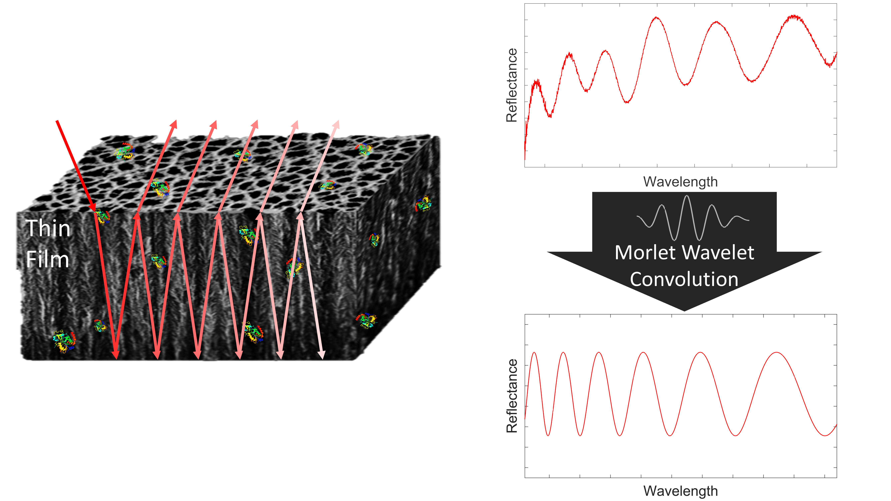
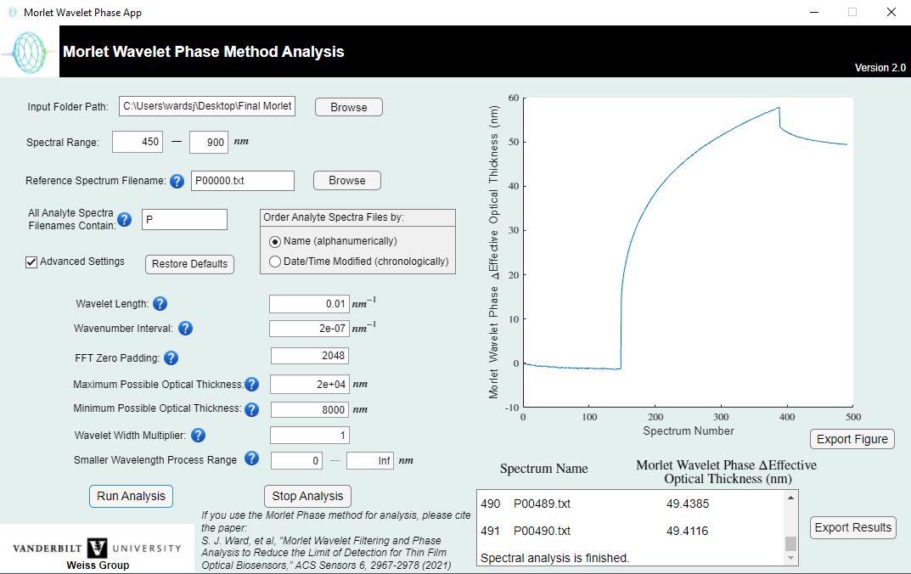
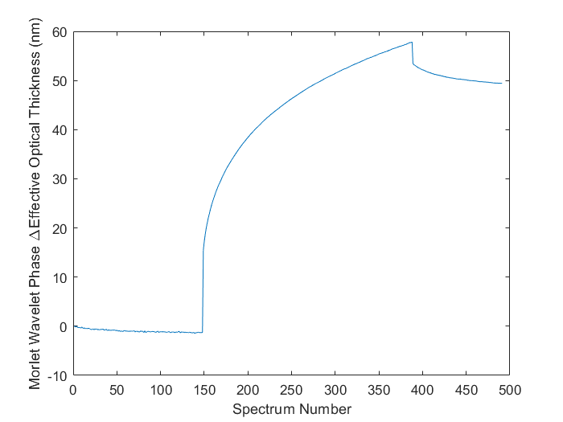

&emsp;&emsp;&emsp;&emsp;&emsp;&emsp;&emsp;

# Enhancing-Biosensor-Detection-Limits
***
For full details, see the following publications:

Ward, S. J., Layouni, R., Arshavsky-Graham, S., Segal, E., & Weiss, S. M. (2021). Morlet Wavelet Filtering and Phase Analysis to Reduce the Limit of Detection for Thin Film Optical Biosensors. _ACS Sensors_ __6__(8), 2967–2978. doi: [10.1021/acssensors.1c00787](https://doi.org/10.1021/acssensors.1c00787)

Ward, S. J., Cao, T., Chang, C., & Weiss, S. M. (2022). Reducing detection limits of porous silicon thin film optical sensors using signal processing. _Proc. SPIE_, __11662__(116620J). doi: [10.1117/12.2579361](https://doi.org/10.1117/12.2579361)

***
## Table of Contents
### 1. Motivation
### 2. Detection Limit
### 3. Signal Processing Approaches
<!-- #### 3.1 Reflectometric Inteferometric Fourier Transform Spectroscopy (RIFTS)
#### 3.2 Interferometer Average over Wavelength (IAW)
#### 3.3 Morlet Wavelet Phase Method -->
### 4. Simulated Data
### 5. Experimental Data
#### 5.1 Porous Silicon
<!--#### 5.2 Data Collection @ Vanderbilt (Nashville, TN)
#### 5.3 Data Collection @ Technion (Haifa, Israel) -->
### 6. Open Source App 
### 7. FAQs
***
## 1. Motivation

Enhancing detection limits of thin film optical sensors using wavelet denoising and Fourier analysis.

<!-- &emsp;&emsp;&emsp;&emsp;&emsp;&emsp;&emsp;&emsp;&emsp;&emsp; 

&emsp;&emsp;&emsp;&emsp;&emsp;&emsp;&emsp; -->

***
## 2. Detection Limit

***
## 3. Signal Processing Approaches
<!--
***
### 3.1 Reflectometric Inteferometric Fourier Transform Spectroscopy (RIFTS)

***
### 3.2 Interferometer Average over Wavelength (IAW)

***
### 3.3 Morlet Wavelet Phase Method

*** -->
## 4. Simulated Data

***
## 5. Experimental Data
### 5.1 Porous Silicon
Porous Silicon (PSi) is silicon with nanostructured pores, which have been electrochemically etched using hydrofluoric acid. Below are shown some images on the scale of a few nanometres taken using an electron microscope, and and illustration of how molecules are captured and detected optically in the pores.

***
<!-- ### 5.2 Data Collection @ Vanderbilt (Nashville, TN)

***
### 5.3 Data Collection @ Technion (Haifa, Israel)

*** -->
## 6. Open Source App 
For information regarding the open source app implementation of the Morlet wavelet phase method, see the [github repository](https://github.com/WeissGroupVanderbilt/MorletWaveletPhaseApp?tab=readme-ov-file#morlet-wavelet-phase-application) or [Weiss group website](https://my.vanderbilt.edu/vuphotonics/resources). The app can be downloaded from the github [landing page](https://weissgroupvanderbilt.github.io/MorletWaveletPhaseApp/) or from the [Matlab file exchange](https://www.mathworks.com/matlabcentral/fileexchange/95968-morlet-wavelet-phase/).

&emsp;&emsp;&emsp;&emsp;

***
### 6.1 Test Data Set
A [test dataset](/MorletWaveletPhaseAlgorithm/Data) is provided with this application consisting of 491 spectrum files (named ”P00000” to “P000490”). The data was generously provided by the Segal group at Technion from experiments published in the following journal article:

Arshavsky-Graham, S. et al. Aptamers: Vs. Antibodies as Capture Probes in Optical Porous Silicon Biosensors. Analyst 2020, 145 (14), 4991–5003.

These spectra were collected using an immunosensor with anti-his tag antibodies immobilized in an oriented configuration. The baseline (“P00000” to “P00146”) and the washing steps (“P00388” to “P00490”) are in PBS buffer, while the increase in the signal corresponds to his-tagged protein target (tyrosinase) exposure at a concentration of 16.5 uM (“P00147” to “P00387”). A similar graph is shown in Figure S4B (black trace).

The resulting exported figure from the Morlet wavelet phase analysis app can be found [here](Figures/MorletWaveletPhaseResultPlot.png); the only non-default settings used were the “Maximum Possible Optical Thickness”, set to 15000, and the “Minimum Possible Optical Thickness”, set to 8000, to ensure the correct peak in the FFT is used.

&emsp;&emsp;&emsp;&emsp;&emsp;&emsp;&emsp;&emsp;&emsp;&emsp;

***
## 7. FAQs

***
