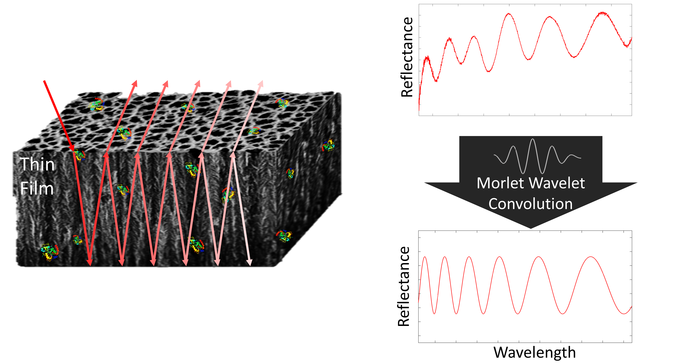

       

# Enhancing-Detection-Limits
***
For full details, see the following publications:

Ward, S. J., Layouni, R., Arshavsky-Graham, S., Segal, E., & Weiss, S. M. (2021). Morlet Wavelet Filtering and Phase Analysis to Reduce the Limit of Detection for Thin Film Optical Biosensors. _ACS Sensors_ __6__(8), 2967–2978. doi: [10.1021/acssensors.1c00787](https://doi.org/10.1021/acssensors.1c00787)

Ward, S. J., Cao, T., Chang, C., & Weiss, S. M. (2022). Reducing detection limits of porous silicon thin film optical sensors using signal processing. _Proc. SPIE_, __11662__(116620J). doi: [10.1117/12.2579361](https://doi.org/10.1117/12.2579361)

***
## Table of Contents
### 1. Motivation
### 2. Experimental Data
#### 2.1 Porous Silicon
#### 2.2 Data Collection
### 3. Data Visualization
#### 3.1 Full Dataset
#### 3.2 Dimensionality Reduced Dataset
#### 3.3 Linear Discriminant Analysis Weightings
### 4. Model Training & Evaluation
### 5. FAQs
### 6. Acknowledgements
***
## 1. Motivation

Enhancing detection limits of thin film optical sensors using wavelet denoising and Fourier analysis.

           

        

***
## 2. Experimental Data
### 2.1 Porous Silicon
Porous Silicon (PSi) is silicon with nanostructured pores, which have been electrochemically etched using hydrofluoric acid. Below are shown some images on the scale of a few nanometres taken using an electron microscope, and an illustration of how molecules are captured and detected optically in the pores.

### 2.2 Data Collection
Porous silicon sensors were fabricated
***
### 3 
#### 3.1 Full Dataset
The full experimental dataset
***
#### 3.2 Dimensionality Reduced Dataset

***
#### 3.3 Linear Discriminant Analysis Weightings

***
### 4 Model Training & Evaluation

A broad selection of machine learning models were applied in this [notebook]()
***
## 5. FAQs

***
## 6. Acknowledgements

***

